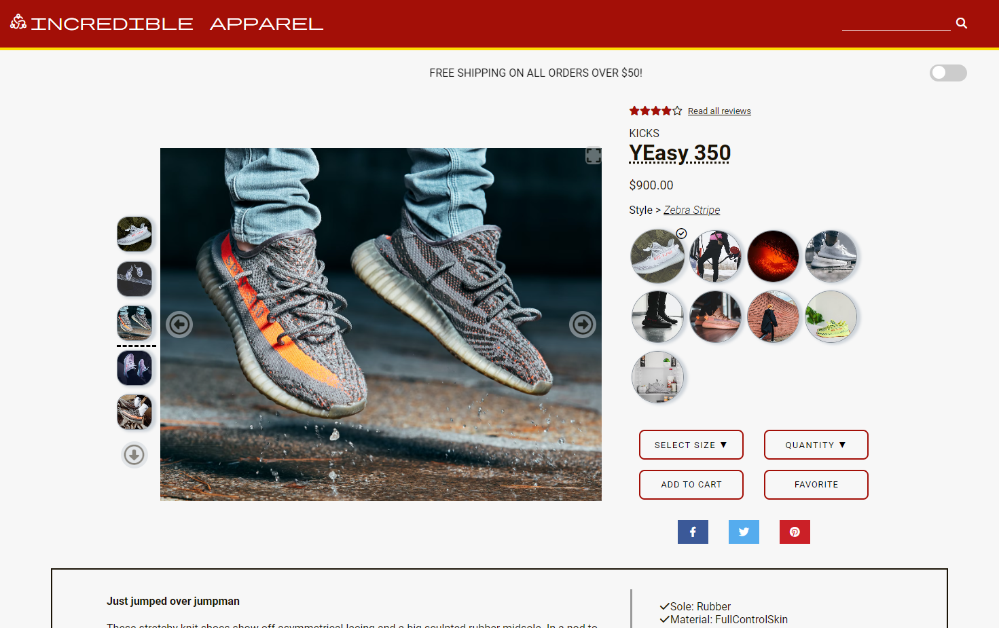
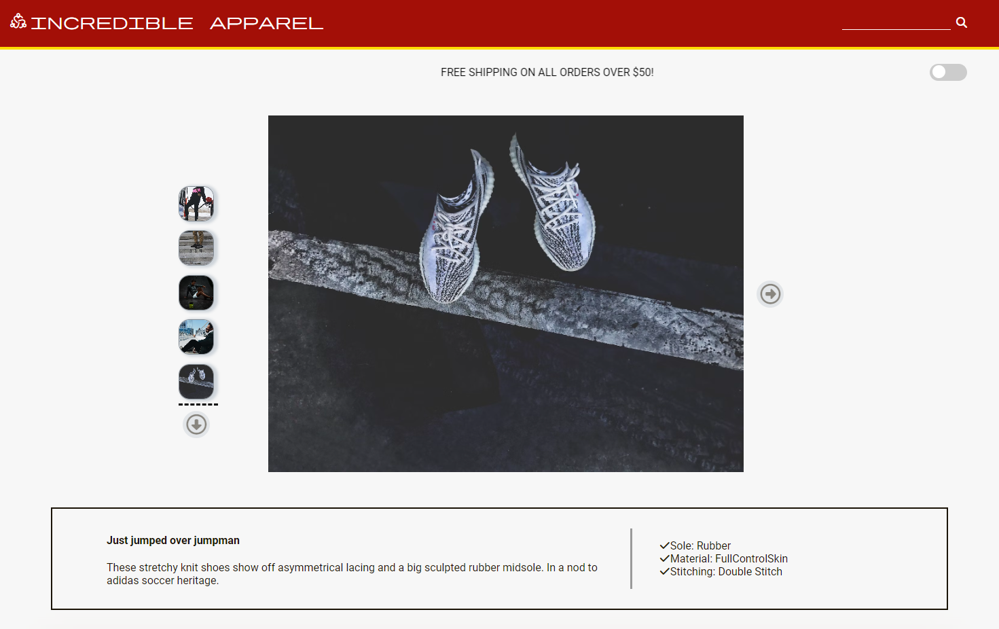
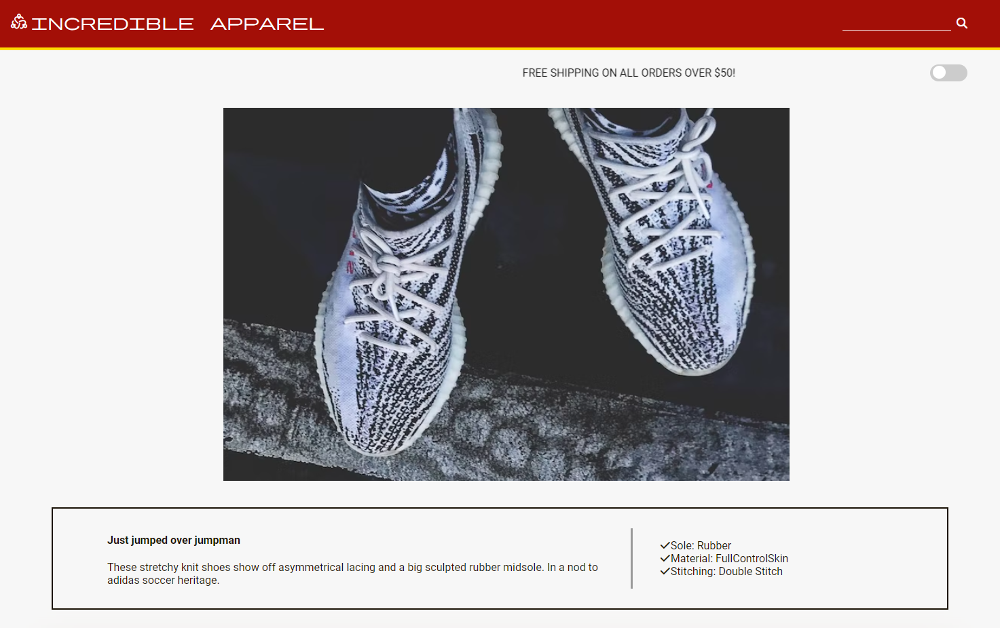
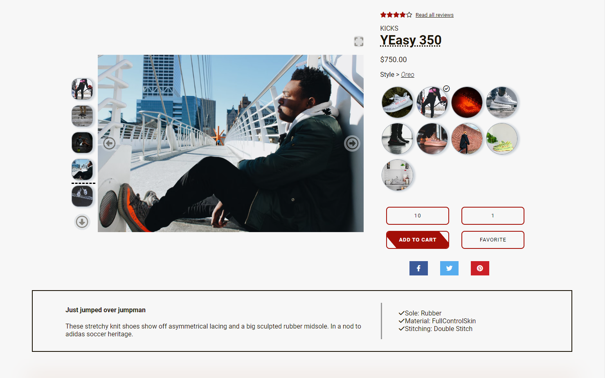
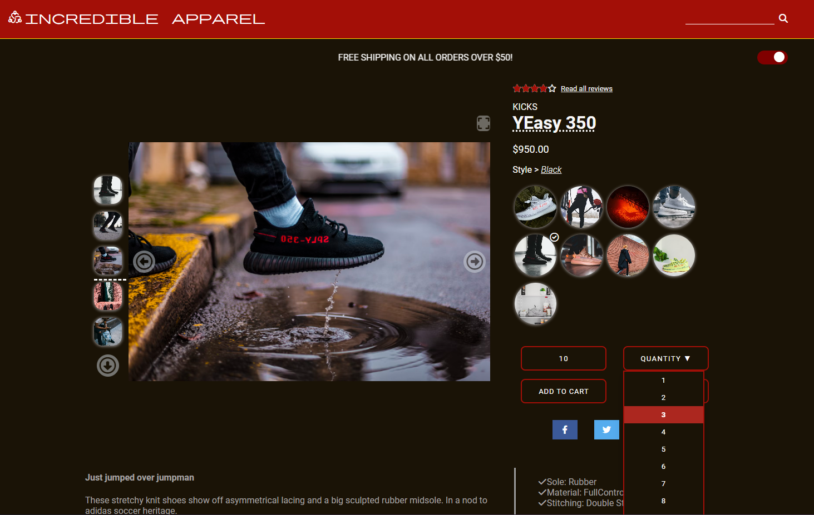
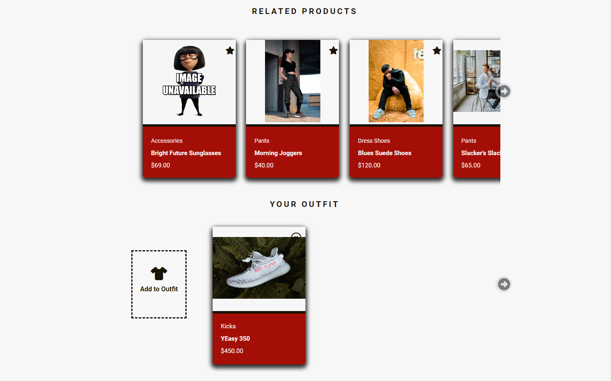
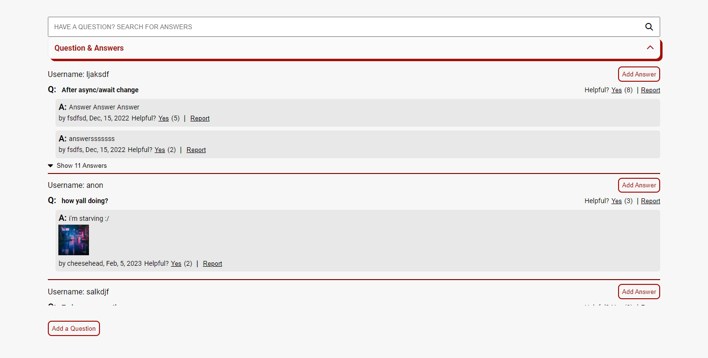
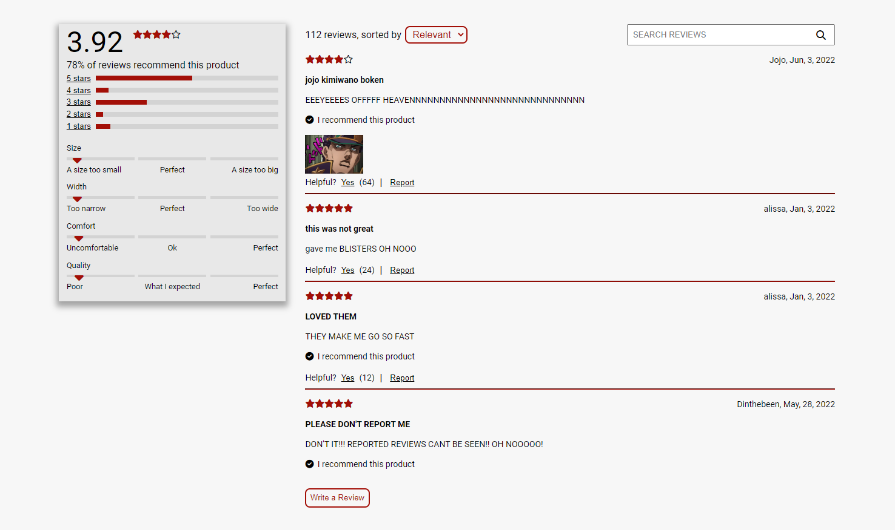

# Incredible Apparel

## About the Project
A personal front-end personal web-design project with a team of 3 to develop a stylish product information page for an e-commerce company.

Raw CSS and React was capitalized for this project - no outside frameworks such as Tailwind or pre-built components such as React-Carousel were used.
React was utilized to build the front-end webpage, Redux implemented to incorporate global state, and a back-end local server created to access appropriate API endpoints.
Web page was hostable on AWS.

The final web page consists of a the main product information section where the user can select and view various product styles, a section where the user can browse related products and build a personal outfit collection, and a section where the user can read relevant product questions/answers and peruse reviews left by previous customers.

## Built With

### Bundled with

### Powered By

## Contributors
* Product Detail: [Jessica Vu](https://github.com/kyrianite) 
* Related Items & Outfit Creation: [Patrick Kelly](https://github.com/Patrick-Kelly-1330) 
* Ratings/Reviews & Questions/Answers: [David Zhang](https://github.com/davidzny195) 

## Web Application

  
  
  
  
  
  
  
  

